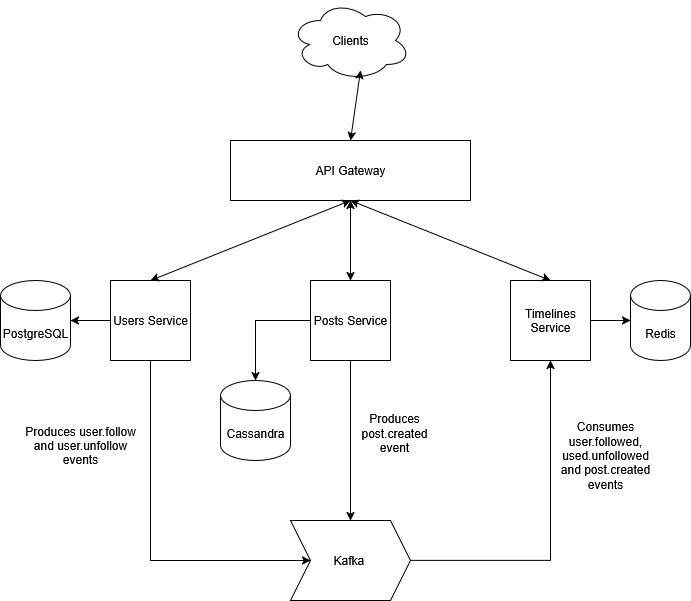

# Microblogging Platform

Simple microblogging platform where users can be created, follow others, publish and see timelines.

## Author

Pablo Ivancich

## Services

### Users service
Handles user lifecycle and social graph.

Responsibilities:
- Create, retrieve, and delete users.
- Follow / unfollow users.
- Emit user.follow and user.unfollow events for downstream consumers

### Posts Service
Handles post creation and storage of user posts.

Responsibilities:
- Create new posts
- Retrieve posts by user (for profile pages, timeline assembly)
- Emit post.created event for downstream consumers

### Timeline Service
Handles timeline assembly and read-optimized view for users.

Responsibilities:
- Consume post.created events → fan-out (on write) posts to followers’ timelines
- Consume user.follow / user.unfollow events → adjust timeline fan-out targets
- Serve timeline for a given user, optimized for fast reads

## Infrastructure

All services rely on the following infrastructure components
- PostgreSQL - primary store for user data
- Redis - fast, in-memory timeline storage
- Cassandra - scalable, write-optimized store for posts
- Kafka - events streaming backbone for communication between services

## Platform Diagram

## Communication Overview

### Event Flow

posts-service publishes post.created events when a user posts something.

users-service publishes user.follow / user.unfollow events when a user follows/unfollows someone.

timeline-service consumes these events to update timelines.

### REST API Flow

Clients call users-service and posts-service REST endpoints.

Clients call timeline-service to retrieve timelines.

## Key Design Decisions

### Event-Driven Fan-Out:
Timeline service is decoupled via Kafka, allowing scalable fan-out of posts to follower timelines.

### Fan-out on write
Timelines are updated when a post is created. This makes read really fast because timeline is already built and stored in Redis.

### Read-Optimized Timelines:
Using Redis for precomputed timelines allows fast retrieval at scale (read-optimized design). Read order is O(1).

### Per-Service Databases:
Each service owns its data store, enabling independent scaling and schema evolution (polyglot persistence).

### Local Development:
A single docker-compose.infra.yml spins up all infrastructure components, while services run independently.

### Monorepo
A monorepo project is used because simplicity for this MVP.

## Next Steps

### Backfills
After a user follow event. Old user posts can be added to timeline.
After a user unfollow event. Old user posts can be removed from timeline.

### Kubernetes
Use Kubernetes as Orchestrator instead of Docker Compose, which is only recommended for development purposes.

### API Gateway
It will be a good approach to have an API Gateway to handle client requests and redirect to services.

### Observability
Implement observability, logging, metrics.

### Search Service 
Implement Search Service with Elasticsearch.